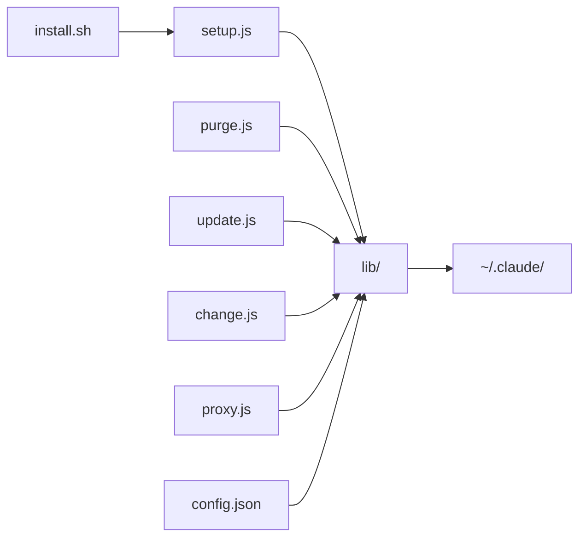

# claude-in-cursor

跨平台（Linux / macOS / Windows，x64 / ARM）一键部署 **Claude Code** + **cc-switch** + **DeepSeek**（或其他 Anthropic 兼容 API）的脚本工具集。

macOS / Linux 推荐使用 `install.sh` 自动检测并安装 Node.js、Git 等依赖后完成部署；Windows 或已具备 Node.js 环境的用户可直接运行 Node.js 脚本。

## 功能

| 脚本 | 用途 |
|------|------|
| `install.sh` | **推荐入口**（macOS / Linux）：检测并安装 Node.js / Git，然后执行部署 |
| `setup.js` | 首次部署：安装 Claude Code、cc-switch、Claude skills，配置 DeepSeek API |
| `update.js` | 升级 Claude Code、cc-switch、skills，并刷新配置文件 |
| `purge.js` | 按需卸载工具或清理配置（交互式菜单） |
| `change.js` | 交互式切换模型；`--list` 查看配置，`profileId` 直接切换 |
| `proxy.js` | 启动本地兼容代理（通常由 `change.js` / `ccs use` 自动拉起） |

## 前置要求

- **Node.js** >= 18（含 npm）— macOS / Linux 可由 `install.sh` 自动安装
- **Git**（Windows 必需；安装 `skill.yaml` 中的 skills 时 macOS/Linux 也必需，可由 `install.sh` 自动安装）
- 对应 API 的 Key（默认 DeepSeek）

`install.sh` 或 `setup.js` 会自动检测以上环境，缺失时给出安装提示或尝试自动安装。

## 快速开始

```bash
# 克隆或进入项目目录
cd claude-in-cursor

# macOS / Linux（推荐）：自动安装依赖并部署
bash install.sh

# 非交互式（推荐）：先导出 API Key，再执行安装
export DEEPSEEK_API_KEY=sk-xxx
bash install.sh

# Windows 或已具备 Node.js >= 18 的环境，可直接部署
node setup.js

# 验证
claude --version
ccs current
claude   # 启动 Claude Code
```

### 自定义配置

复制示例配置并按需修改：

```bash
cp config.example.json config.json
```

`config.json` 不会被 git 跟踪。可修改模型名称、API 地址、profile 名称等，后续换用其他模型 API 时只需改此文件。**请勿在 `config.json` 中写入 API Key**（脚本会拒绝 `apiKey` 等敏感字段）。

## 安全使用

- **推荐**：先 `export DEEPSEEK_API_KEY=...`，再运行 `bash install.sh`（或 `node setup.js`），避免 `KEY=xxx bash install.sh` 进入 shell 历史
- **禁止**：不要把 Key 写入 `config.json`（含 `apiKey`、`token`、`secret` 等字段会被拒绝）
- **交互输入**：已启用掩码（输入不可见），但在 IDE 终端日志或共享屏幕场景仍可能泄露，慎用
- **本地文件**：Key 以明文存于 `~/.claude/settings.json` 与 `profiles/*.json`，脚本写入后自动 `chmod 600`
- **备份清理**：cc-switch 切换时会在 `~/.claude/cc-switch-backups/` 留存含 token 的备份，需手动执行 `node purge.js` 选项 `[6]` 或 `node purge.js --backups --yes`
- **泄露后**：在提供商控制台轮换 Key，然后 `export DEEPSEEK_API_KEY=新Key && node update.js --config-only`

## 脚本详解

### install.sh — 一键安装与部署（macOS / Linux）

```bash
bash install.sh
```

执行流程：

1. 检测系统平台与架构（`darwin/arm64`、`linux/x86_64` 等）
2. 若缺失或版本过低，自动安装 **Node.js** >= 18 与 **npm**（Homebrew / apt / dnf / nvm 等）
3. 若缺失，自动安装 **Git**
4. 调用 `node setup.js` 完成 Claude Code、cc-switch 安装、skills 同步与 API 配置

> **Windows** 不支持 `install.sh`，请确保已安装 Node.js >= 18 与 Git 后，直接运行 `node setup.js`。

### setup.js — 部署

```bash
bash install.sh    # macOS / Linux 推荐
node setup.js      # Windows 或已具备 Node.js 环境
# 或
npm run setup
```

执行流程：

1. 检测系统平台与架构（`darwin/arm64` 等）
2. 检查 Node.js、npm、Git
3. 全局安装 `@anthropic-ai/claude-code`（npm，失败时自动切换备用源）
4. 全局安装 `@supertiny99/cc-switch`（同上）
5. 按 `skill.yaml` 将 skills clone 到 `~/.agents/skills/`（已存在则 fetch/pull），并软链接到 `~/.claude/skills`、`~/.cursor/skills`、`~/.codex/skills`
6. 读取 `config.json`（或内置默认值）
7. 获取 API Key（环境变量优先，缺失则掩码交互输入）
8. 写入 `~/.claude/settings.json` 与 `~/.claude/profiles/<profileId>.json`
9. 通过 `ccs use <profileId>` 激活配置，并按需启动兼容代理

**API Key 环境变量**（按优先级）：

- `DEEPSEEK_API_KEY`
- `ANTHROPIC_AUTH_TOKEN`

### update.js — 升级

```bash
node update.js
# 或
npm run update
```

- 升级 `@anthropic-ai/claude-code@latest`
- 升级 `@supertiny99/cc-switch@latest`
- 同步 `skill.yaml` 中的 skills（更新 `~/.agents/skills` 并刷新各 IDE 软链接）
- 若存在 `config.json` 且 API Key 可用，重新写入 settings 与 profile

可选参数：

| 参数 | 说明 |
|------|------|
| `--claude-only` | 仅升级 Claude Code |
| `--ccs-only` | 仅升级 cc-switch |
| `--skills-only` | 仅同步 skills |
| `--skip-mcp` | 跳过 MCP 配置（无 Python 环境或 CI 时使用） |
| `--local` | 扫描本地 skills 目录，合并并写回 `skill.yaml`，再同步 `~/.agents/skills` |
| `--local --skills-only` | 仅本地合并 + skills 同步，不升级 claude/cc-switch |
| `--config-only` | 仅刷新配置，不升级包 |

### purge.js — 卸载

```bash
node purge.js               # 交互式菜单，按需选择
node purge.js --tools       # 仅卸载 npm 全局包
node purge.js --config      # 仅清理本工具写入的配置
node purge.js --backups     # 仅清理 cc-switch 备份（含 token）
node purge.js --all         # 清理工具与配置 (1+2+3+4)，不含备份
node purge.js --all --yes   # 全部清理，跳过确认
node purge.js --backups --yes  # 清理备份，跳过确认
node purge.js --mcp-academic-search --yes  # 移除 academic-search MCP
```

交互菜单：

```
[1] 卸载 Claude Code (npm global)
[2] 卸载 cc-switch (npm global)
[3] 移除本工具创建的 profile
[4] 清除 settings.json 中的 provider env 变量
[5] 全部执行 (1+2+3+4)
[6] 清理 cc-switch 备份（可能含 token）
[7] 移除 academic-search MCP 配置
[0] 取消
```

> 安全原则：不会删除整个 `~/.claude` 目录（可能包含会话、插件等用户数据）。

### change.js — 切换模型

```bash
node change.js                # 交互式选择（默认）
node change.js deepseek       # 切换到 deepseek profile
node change.js --list         # 仅查看当前配置与 profile 列表
```

底层调用 cc-switch 的 `ccs current`、`ccs list`、`ccs use`。

### ~/.agents 统一架构

Agent 共享资源统一存放在 `~/.agents/`，Claude / Cursor / Codex 对应路径通过软链接指向同一 canonical 源：

| 链接路径（IDE 侧） | 指向（canonical） |
|---|---|
| `~/.claude/skills` | `~/.agents/skills` |
| `~/.cursor/skills` | `~/.agents/skills` |
| `~/.codex/skills` | `~/.agents/skills` |
| `~/.claude/.mcp.json` | `~/.agents/mcp.json` |
| `~/.cursor/mcp.json` | `~/.agents/mcp.json` |
| `~/.codex/mcp.json` | `~/.agents/mcp.json` |

首次 setup 时，若 IDE 侧已有独立 `mcp.json`，会自动合并到 `~/.agents/mcp.json` 后替换为软链接。Claude Code 的 `enabledMcpjsonServers` 仍在 `~/.claude/settings.json`（含 API Key 等私有配置，不可 symlink）。

### skill.yaml — Claude skills 清单

项目根目录的 `skill.yaml` 定义要安装的技能仓库。Git 操作在 `~/.agents/skills` 指向的实际目录中执行（允许 `~/.agents/skills` 本身为 symlink，例如指向 `~/workspace/insight/skills`）。

同步时通过 **realpath** 比对四个目录下同名 skill 是否为同一目录。支持两种 IDE 布局：

**方式 A — 目录级软链接（推荐，可与其他 IDE 共用）：**

```
~/.claude/skills  →  ~/.agents/skills
~/.cursor/skills  →  ~/.agents/skills
~/.codex/skills   →  ~/.agents/skills
```

**方式 B — 逐 skill 软链接**（当 IDE 的 `skills/` 为独立目录时）：

```
~/.claude/skills/{name}  →  ~/.agents/skills/{name}
```

- `~/.agents/skills` 本身可为 symlink（例如指向 `~/workspace/insight/skills`）
- 若 IDE 的 `skills/` 已是 `~/.agents/skills` 的软链接，或解析到同一目录，则跳过逐 skill 建链
- 若同名 skill 解析路径不一致，以 `~/.agents/skills/{name}` 为准替换为软链接
- 缺失的 IDE `skills/` 目录会默认创建指向 `~/.agents/skills` 的目录软链接

```yaml
skills:
  - name: gpt-image2-ppt-skills
    url: https://github.com/JuneYaooo/gpt-image2-ppt-skills.git
  - name: image-to-editable-ppt-skill
    url: https://github.com/ningzimu/image-to-editable-ppt-skill.git
  - name: nature-skills
    url: https://github.com/Yuan1z0825/nature-skills.git
```

| 字段 | 说明 |
|------|------|
| `name` | 目标目录名（`~/.agents/skills/{name}`） |
| `url` | HTTPS 仓库地址（clone 优先使用，pull 失败时回退 SSH） |
| `ssh_url` | 可选，显式 SSH 回退地址 |
| `branch` | 可选，默认 `main` |

- `setup.js` / `install.sh`：clone 到 `~/.agents/skills`（已存在则 fetch/pull），并校验各 IDE 目录下同名 skill 是否与 agents 为同一目录；不一致则以 agents 为准替换为软链接
- `node update.js`：更新 `~/.agents/skills` 并执行上述校验与链接
- `node update.js --local`：扫描本机 skills 目录，将本地 git skill 追加写入 `skill.yaml`（无 `.git` 的目录跳过并警告），再同步

### nature-skills

[nature-skills](https://github.com/Yuan1z0825/nature-skills) 提供 Nature 期刊风格的学术写作、润色、审稿、科研绘图等 skill，已纳入 `skill.yaml`，整仓 clone 到 `~/.agents/skills/nature-skills/`（monorepo，含 10 个 `nature-*` skill 与 `skills/_shared/`）。

| Skill | 用途 | 触发示例 |
|---|---|---|
| nature-polishing | Nature 风格润色 | "Nature style", "polish abstract" |
| nature-writing | 稿件章节撰写 | "write introduction", "manuscript draft" |
| nature-figure | 科研绘图 | "Nature figure", "publication plot" |
| nature-reader | 全文双语 Markdown 阅读 | "nature reader", "全文翻译" |
| nature-reviewer | 审稿人视角评估 | "pre-submission review" |
| nature-citation | CNS 引用检索 | "Nature citation", "Zotero RDF" |
| nature-data | 数据可用性声明 | "Data Availability" |
| nature-response | 审稿意见回复 | "response to reviewers" |
| nature-paper2ppt | 论文转中文 PPT | "paper PPT", "journal club" |
| nature-academic-search | 文献检索 MCP | "search papers", "verify DOI" |

**MCP 配置**（`nature-academic-search`）：setup/update 会自动写入 `~/.agents/mcp.json` 并在 Claude Code 启用 `academic-search`。前置条件：

- `python3` 及 `pip3`
- 设置 `PUBMED_EMAIL` 环境变量，或在 `config.json` 中配置 `pubmedEmail`
- 可选：`NCBI_API_KEY` 提高 PubMed 限速

```bash
export PUBMED_EMAIL=your@email.com
node update.js --skills-only   # 同步 skill + MCP
node setup.js --skip-mcp       # 跳过 MCP 配置
node purge.js --mcp-academic-search --yes  # 移除 MCP 条目
```

安装后重启 Cursor / Claude Code 使 MCP 生效。与 `gpt-image2-ppt-skills` 不冲突（nature-paper2ppt 偏中文学术组会，gpt-image2 偏视觉生成）。

## 配置文件说明

`config.example.json`：

```json
{
  "provider": "deepseek",
  "baseUrl": "https://api.deepseek.com/anthropic",
  "useProxy": true,
  "proxyPort": 19876,
  "proxyListenHost": "127.0.0.1",
  "model": "deepseek-v4-pro[1m]",
  "opusModel": "deepseek-v4-pro[1m]",
  "sonnetModel": "deepseek-v4-pro[1m]",
  "haikuModel": "deepseek-v4-flash",
  "subagentModel": "deepseek-v4-flash",
  "effortLevel": "max",
  "claudeModelTier": "opus",
  "profileId": "deepseek",
  "profileName": "DeepSeek",
  "profileDescription": "DeepSeek Anthropic-compatible API",
  "profileIcon": "🐋",
  "apiKeyEnv": ["DEEPSEEK_API_KEY", "ANTHROPIC_AUTH_TOKEN"],
  "npmRegistries": ["default", "https://registry.npmmirror.com"],
  "pubmedEmail": "",
  "natureMcp": true
}
```

| 字段 | 说明 |
|------|------|
| `baseUrl` | Anthropic 兼容 API 地址 |
| `useProxy` / `proxyPort` / `proxyListenHost` | 是否启用本地兼容代理及监听地址 |
| `model` / `opusModel` / `sonnetModel` / `haikuModel` | 各档位模型 |
| `subagentModel` | 子代理模型 |
| `effortLevel` | Claude Code 努力程度 |
| `claudeModelTier` | Claude Code 默认模型档位 |
| `profileId` / `profileName` | cc-switch profile 标识与显示名 |
| `profileDescription` / `profileIcon` | profile 描述与图标 |
| `apiKeyEnv` | 读取 API Key 的环境变量列表 |
| `npmRegistries` | npm 安装源列表，按顺序尝试；`default` 表示 npm 当前默认源 |
| `pubmedEmail` | PubMed MCP 联系邮箱（也可用 `PUBMED_EMAIL` 环境变量） |
| `natureMcp` | 是否在 setup/update 时配置 academic-search MCP，默认 `true` |

默认安装源顺序：`default` → `https://registry.npmmirror.com`。网络差时会自动切换备用源。

```json
"npmRegistries": ["default", "https://registry.npmmirror.com"]
```

## 生成的文件位置

```
~/.agents/
├── mcp.json                   # MCP 配置（canonical）
└── skills/                    # skill 仓库（由 skill.yaml 管理）
~/.claude/
├── .mcp.json                  # → ~/.agents/mcp.json（软链接）
├── settings.json              # Claude Code 当前环境变量配置
├── profiles/
│   └── deepseek.json          # cc-switch profile（可多个）
├── skills/                    # → ~/.agents/skills（软链接）
└── cc-switch-backups/         # cc-switch 自动备份
~/.cursor/
├── mcp.json                   # → ~/.agents/mcp.json（软链接）
└── skills/                    # → ~/.agents/skills（软链接）
~/.codex/
├── mcp.json                   # → ~/.agents/mcp.json（软链接）
└── skills/                    # → ~/.agents/skills（软链接）
```

## 项目结构

```
claude-in-cursor/
├── lib/                 # 公共模块（平台检测、安装、配置写入、代理等）
├── install.sh           # 一键安装入口（macOS / Linux）
├── setup.js             # 部署入口（由 install.sh 调用）
├── proxy.js             # 兼容代理入口
├── purge.js             # 卸载入口
├── update.js            # 升级入口
├── change.js            # 切换入口
├── skill.yaml           # Claude skills 清单
├── config.example.json  # 配置模板
├── config.json          # 本地配置（gitignore）
├── package.json
└── README.md
```

## 架构



## 跨平台说明

- **macOS / Linux**：运行 `bash install.sh`，自动安装 Node.js / Git 后执行部署
- **Windows**：`install.sh` 不可用，请手动安装 Node.js >= 18 与 Git，再运行 `node setup.js`
- 部署逻辑统一由 **Node.js 脚本** 完成，npm 自动处理 AMD/ARM 架构差异
- 通过 `npm install -g` 安装 Claude Code 与 cc-switch
- Windows 安装后若命令找不到，检查 `%APPDATA%\npm` 是否在 PATH 中
- macOS/Linux 可执行 `npm bin -g` 查看全局 bin 路径

## 已知问题与修复

| 问题 | 修复 |
|------|------|
| 同时设置 `ANTHROPIC_AUTH_TOKEN` 和 `ANTHROPIC_API_KEY` 导致 Auth conflict | 仅写入 `ANTHROPIC_AUTH_TOKEN` |
| settings.json 浅合并残留旧 env key | 写入前清除本工具管理的 key 列表 |
| 交互输入明文可见 | 掩码输入 `askSecret` |
| settings.json 权限过宽 | 写入后自动 chmod 600 |
| config.json 误放 apiKey | 检测到敏感字段则拒绝退出 |
| cc-switch 备份残留 token | purge 选项 `[6]` / `--backups` 独立清理 |

## 相关链接

- [Claude Code](https://github.com/anthropics/claude-code)
- [cc-switch (@supertiny99/cc-switch)](https://www.npmjs.com/package/@supertiny99/cc-switch)
- [DeepSeek API](https://api.deepseek.com/)
- [nature-skills](https://github.com/Yuan1z0825/nature-skills)
